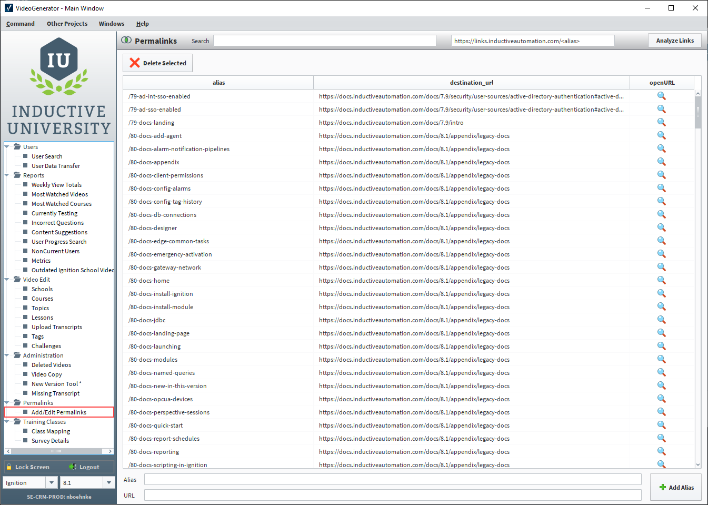

[Documentation Workflow](/index.md) - **Table of Contents**

|[User Manual Update Guide](/user-manual-update-guide/user-manual-update-guide.md)|[User Manual Style Guide](/user-manual-style-guide/user-manual-style-guide.md)|[Tips and Tricks](/tips-and-tricks/tips-and-tricks.md)| 
|--|--|--|
|[Branching and Page Updates](/user-manual-update-guide/branching-and-page-updates.md) [Ignition Updates Board](/user-manual-update-guide/ignition-updates-board/ignition-updates-board.md)<li>[Planning Meetings and IGN Issue Review](/user-manual-update-guide/ignition-updates-board/planning-meetings-and-ign-issue-review.md)</li><li>[Internal Version and Complete Changelogs](/user-manual-update-guide/ignition-updates-board/internal-version-and-complete-changelogs.md)</li>[Writing Tasks Board](/user-manual-update-guide/writing-tasks-board.md) [Deprecated Pages](/user-manual-update-guide/deprecated-pages.md) [User Manual Versioning](/user-manual-update-guide/user-manual-versioning.md)|[Structure and Navigation](/user-manual-style-guide/structure-and-navigation.md) [Formatting Guidelines](/user-manual-style-guide/formatting-guidelines.md) [Style Conventions](/user-manual-style-guide/style-conventions.md) [Syntax for Functions](/user-manual-style-guide/syntax-for-functions.md) [Images](/user-manual-style-guide/images.md) [Word List](/user-manual-style-guide/word-list.md)|[CheatSheets](/tips-and-tricks/cheatsheets/cheatsheets.md)<li>[Drivers](/tips-and-tricks/cheatsheets/new-drivers.md)</li>[Documentation Permalinks](/documentation-permalinks.md)|  

# Documentation Permalinks

Placing links to the documentation from the software or other external facing documents is incredibly helpful, but has a potentional risk that links will become invalidated as changes. Using permalinks is a viable long term solution that allows the static links always redirect users to the appropriate documentation. 

## User Manual References
Links that are listed in the software are maintained and updated by Development. Marketing, Sales, or other departments may also require permalinks from time to time. Although the Docs team is generally responsible for creating permalinks, any user with permissions in the **VideoGenerator** project on the CRM Gateway can add, edit, and delete permalinks. 

The links to pages in the User Manual are automatically created through the permalinks table in the Website schema. 

### To access the permalinks table: 

1. Open the VideoGenerator project from the Vision Client Launcher.
    :::note
    If you don't already have the project added, the Gateway URL is https://crm.ia.local:8043/main/system/webdev/VideoGenerator/permalinks. 
    :::
2. Log in using your CRM username and password.
3. Select the Add/Edit Permalinks file under the Permalinks folder on the sidebar.

    

This page lists all available permalinks.The columns in the table are: 

* **alias** - The value/link address used in the Ignition code. This is a valid URL on the Inductive Automation website and will use the lookup table for the correct address.
    * /81-docs-install-ignition
    
        :::note
        Since this column displays only the alias part of the permalink, make sure that when sharing permalinks you add the static permalink URL to the front of the alias. The static URL is displayed on the top of the page: `https://links.inductiveautomation.com`. When you select a permalink from the table, the alias will autofill in the permalink `/<alias>` placeholder. 
        :::

* **destination_url** - The URL for the given page in the User Manual.
    * https://docs.inductiveautomation.com/docs/8.1/getting-started/installing-and-upgrading

* **openURL** - Double-clicking the magnifying glass  icon in the openURL column will open the linked User Manual page. 

### Creating New Permalinks
Before creating a new permalink, use the search to make sure a permalink for that page or location doesn't already exist. 

1. Enter the chosen alias in **Alias** field at the bottom of the page. 
2. Paste the User Manual URL in the **URL** field. 
3. Select **+ Add Alias**.
4. Verify the address is added to the list. 

Remember when sharing the newly created permalink, make sure to send the full URL, not just the alias. 

### Editing or Deleting Permalinks

Permalinks can be edited by simply clicking into the field that needs to be updated and typing or pasting over the existing text. To delete a permalink entry, locate and select the existing row, and click **Delete Selected**. 

:::caution
There is no auditing trail, so be mindful when making changes to paste URLs with corresponding aliases and not delete or add permalinks accidently. 
:::

The **Analyze Links** option on the top of the page can be used to see if an existing links are invalid and should be edited or removed. It's best to reserve this function for full audits as it does take time. If you only have one or two links to verify, using the search or scrollbar to locate the permalink will be much faster.   