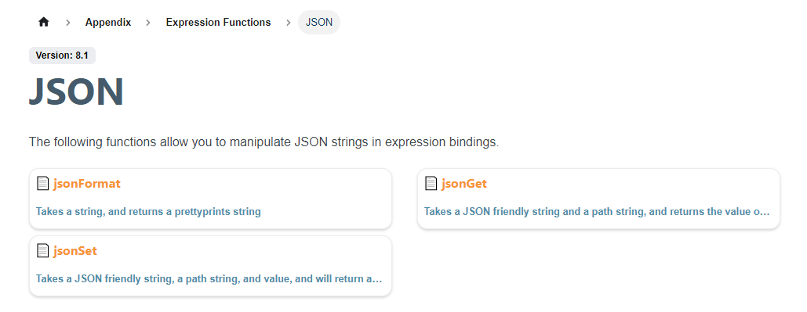
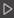
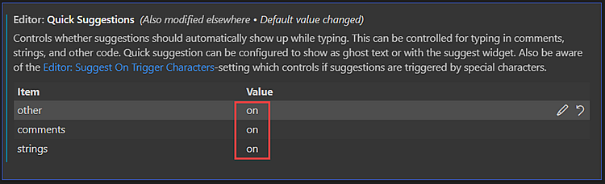

<details>

<summary>**Table of Contents**</summary>

|[Documentation Workflow](/index.md)|  |
|--|--|
|[User Manual Update Guide](/user-manual-update-guide/user-manual-update-guide.md)|<li>[Branching and Page Updates](/user-manual-update-guide/branching-and-page-updates.md)</li><li>[Ignition Updates Board](/user-manual-update-guide/ignition-updates-board/ignition-updates-board.md)</li><ul><li>[Planning Meetings and IGN Issue Review](/user-manual-update-guide/ignition-updates-board/planning-meetings-and-ign-issue-review.md)</li><li>[Internal Version and Complete Changelogs](/user-manual-update-guide/ignition-updates-board/internal-version-and-complete-changelogs.md)</li></ul><li>[Writing Tasks Board](/user-manual-update-guide/writing-tasks-board.md)</li><li>[Deprecated Pages](/user-manual-update-guide/deprecated-pages.md)</li><li>[User Manual Versioning](/user-manual-update-guide/user-manual-versioning.md)</li>|
|[User Manual Style Guide](/user-manual-style-guide/user-manual-style-guide.md)|<li>[Structure and Navigation](/user-manual-style-guide/structure-and-navigation.md)</li><li>[Formatting Guidelines](/user-manual-style-guide/formatting-guidelines.md)</li><li>[Style Conventions](/user-manual-style-guide/style-conventions.md)</li><li>[Syntax for Functions](/user-manual-style-guide/syntax-for-functions.md)</li><li>[Images](/user-manual-style-guide/images.md)</li><li>[Word List](/user-manual-style-guide/word-list.md)</li> |
|[Tips and Tricks](/tips-and-tricks/tips-and-tricks.md)|<li>[CheatSheets](/tips-and-tricks/cheatsheets/cheatsheets.md)</li><ul><li>[Drivers](/tips-and-tricks/cheatsheets/new-drivers.md)</li></ul><li>[Documentation Permalinks](/documentation-permalinks.md)</li>|

</details>

# Tips and Tricks

One of the most important tips to remember when working on User Manual pages is to keep the user in mind as you write. Keeping the user in mind means including and organizing content in a way that best serves the audience who will come looking for it. We are not only responsible for collecting information and knowledge on given topics, but understanding who will be reading about them. The following list includes aspects to consider once all information is gathered and you are now creating or editing a page:

* The most important content should be in the first or last sentence of a paragraph/section to easily highlight or summarize information.
* Ask yourself if included images actually help the user follow along, or are they distracting or unnecessarily breaking up content? 
* Although links are highly encouraged, linking too often can also cause issues for readers. If the same word is linked multiple times throughout a paragraph, are we really expecting the users to click on each instance just to see the same information they have already viewed? In the same way links are extremely helpful in connecting content and keeping sections organized, this means they can also send users jumping around the manual and opening multiple browsers in a short period. Sending a user to multiple pages or sites too much may become overwhelming or too distracting if the links aren't actually helpful or necessary. 
* Spacing on a page is also important to consider as it subconsciously impacts how a page is read. Make sure text isn't too close (or too far) to images or cards, or caught in their shadow effects. 

## Docusaurus

### Front Matter

Front matter for our pages are listed at the top of each Markdown page wrapped by hyphens (---) to provide additional metadata for the doc pages. The front matter fields most commonly used are listed below:

```
---
title:
sidebar_position:
description: 
tags:
---
```

The `title` field will display the page title as written. It will typically match the name of the MD file, but if a page title needs to be updated, do so using the title field and do not change the MD file name. This will update the page for the user and search function, but will not interrupt existing links. 

The `sidebar_position` field dictates the order folders and pages appear in the navigation panel. If this field is not used, or if multiple pages within the same level use the same position number, docusaurus defaults the order alphabetically. 

The `description` field is used most commonly on function pages where the cards for subpages are listed. Since the card can only hold a few words, the description should never be more than a sentence. Including quotes in a description can also cause build issues, so it is best to leave them out.  

The `tags` field is used on the function pages to autopopulate the corresponding function scopes on under the Functions by Scope heading on the parent pages. 




### NPM Scripts

There are many NPM scripts included in VS code through the docusaurus `package.json` file. Some common ones are included below, but a full list is described [here](https://docusaurus.io/docs/cli). 

#### Run Install

If you are receiving an error when attempting to execute a task because something is already running on port 3000, right-click the `package.json` and select Run Install.

#### Run Start

Preview pages using the npm run start command, which builds your website locally and serves it through a development server, ready for you to view at http://localhost:3000/.

To preview your changes as you edit the files, you can run a local development server that will serve your website and reflect the latest changes. To launch a local server, enter `npm run start` into the terminal or hover over the package.json > start script and select the **Run**  icon.

By default, a browser window will open at http://localhost:3000.

#### Run Build

Since Docusaurus is a modern static website generator, we need to build the website into a directory of static contents and put it on a web server so that it can be viewed. To build the website enter `npm run build` into the terminal or hover over the package.json > build script and select the **Run**  icon.

This script deploys the site for production, instead of just locally, which helps identify issues that will cause PRs to fail.

### Deleting Folders or Pages

There may be a lot of incoming links to a certain page, and currently there is process to search for all instances of an incoming link until attempting to build the site and it fails. Therefore, DON'T delete a page unless absolutely necessary, and if you do then build the site locally before pushing to GitHub so you can identify and fix any links that broke as a result.


## VS Code Snippets 

To add code snippets to Visual Studio Code:

1. Click on the **Manage Settings**  icon on the lower left and select User Snippets.
2. Select **New Global Snippets file...**.
3. Enter a name for this snippet file, such as **md-shortcuts**. 
4. Enter snippets as desired. Below are some snippets that you can copy/paste into this file, tweaking as needed.

To enable VS Code to automatically pull up the shortcut option any time a prefix is entered on a page, you'll have to adjust your Preferences. 

1. Select **View** > **Command Palette** or press `ctrl`+`shift`+`p` to open the command palette. 
2. Search and select **Preferences: Configure Language Specific**.
3. Seach and select **Markdown**. 
4. Search **Quick Suggestions** and turn the **other**, **comments**, and **strings** values to **on**.  <p></p>
    

Now you can access any markdown page and populate your snippets by simply typing the snippet prefix and pressing `enter`.

However, if you don't want to have suggestions on at all times, you can leave these settings off and press `ctrl`+`space` to trigger the dropdown options and type the snippet prefix to select the shortcut you want. 

### Snippet Examples

The top section of the global snippets page can be left as is for future reference. If no changes are made, you'll begin entering your snippets on line 18, moving the existing closing curly bracket to the bottom of your file. 

Copy and paste the following snippet examples to your global snippet file or use them for reference when building your own. Be sure to indent each snippet and separate each with a comma. 


```python title="Versioning Snippets"
	"NewIn": {
		"scope": "",
		"prefix": "ni",
		"body": [
			"<NewIn version=\"${1|8.1.,7.9.,8.0.,8.3.|}${2:0}\" />"
		],
		"description": "New in this version."
	},
	"ChangedIn": {
		"scope": "",
		"prefix": "ci",
		"body": [
			"<ChangedIn version=\"${1|8.1.,7.9.,8.0.,8.3.|}${2:0}\" />"
		],
		"description": "Changed in this version."
	},
	"NewMobile": {
		"scope": "",
		"prefix": "nm",
		"body": [
			"<NewMobile version=\"$1\" />"
		],
		"description": "New in Perspective Mobile app version."
	}
```
```python title="Card Snippets"
	"IUCard": {
		"scope": "",
		"prefix": "iu",
		"body": [
			"<IUCard title=\"$1\" link=\"$2\" /><br />"
		],
		"description": "IU video link card."
	},
	"KBACard": {
		"scope": "",
		"prefix": "kba",
		"body": [
			"<KBACard title=\"$1\" link=\"$2\" description=\"$3\" /><br />"
		],
		"description": "KBA link card."
	}
```


```python title="Special Text Snippets"
	"Codeblock": {
		"scope": "",
		"prefix": "cd",
		"body": [
			"```${1|python,json,java|} ${2:title=\"$3\"}",
			"${4:body}",
			"```"
		],
		"description": "Empty code block."
	},
	"InfoBubbles": {
		"scope": "",
		"prefix": "info",
		"body": [
			":::${1|note,tip,caution,danger|} ${2:title}",
			"${3:body}",
			":::"
		],
		"description": "Information bubbles."
	}
```


```python title="Tab Snippet"
	"Tabs": {
		"scope": "",
		"prefix": "tab",
		"body": [
			"<Tabs groupId=\"$1\">",
				"<TabItem value=\"$2\" label=\"$3\">",
				"</TabItem>",
				"<TabItem value=\"$4\" label=\"$5\">",
				"</TabItem>",
				"<TabItem value=\"$6\" label=\"$7\">",
				"</TabItem>",
			"</Tabs>"
		],
		"description": "Tab groups."
	}
```

```python title="Table Snippets"
	"InLineCode": {
		"scope": "",
		"prefix": "ilc",
		"body": [
			"<pre>$1</pre>"
		],
		"description": "Inline codeblock for tables."
	},
	"InLineUnorderedList": {
		"scope": "",
		"prefix": "ul",
		"body": [
			"<ul>",
				"<li>$1</li>",
				"<li>$2</li>",
				"<li>$3</li>",
				"<li>$4</li>",
				"<li>$5</li>",
				"<li>$6</li>",
				"<li>$7</li>",
				"<li>$8</li>",
				"<li>$9</li>",
			"/ul>"
		],
		"description": "Inline unordered list for tables."
	},
	"InLineOrderedList": {
		"scope": "",
		"prefix": "ol",
		"body": [
			"<ol>",
				"<li>$1</li>",
				"<li>$2</li>",
				"<li>$3</li>",
				"<li>$4</li>",
				"<li>$5</li>",
				"<li>$6</li>",
				"<li>$7</li>",
				"<li>$8</li>",
				"<li>$9</li>",
			"</ol>"
		],
		"description": "Inline ordered list for tables."
	},
    	"2xLineBreak": {
		"scope": "",
		"prefix": "br",
		"body": [
			"<br /><br />"
		],
		"description": "Double line break."
	},
	"TablewoHeadings": {
		"scope": "",
		"prefix": "table",
		"body": [
			"<table>",
				"<tr>",
					"<td>$1</td>",
					"<td>$2</td>",
					"<td>$3</td>",
				"</tr>",
				"<tr>",
					"<td>$4</td>",
					"<td>$5</td>",
					"<td>$6</td>",
				"</tr>",
				"<tr>",
					"<td>$7</td>",
					"<td>$8</td>",
					"<td>$9</td>",
				"</tr>",
			"</table>"
		],
		"description": "Table without headings."
	}
```