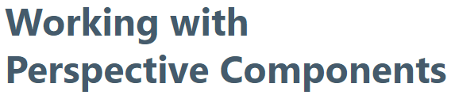
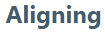
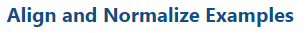
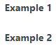

<details>

<summary>**Table of Contents**</summary>

|[Documentation Workflow](/index.md)|  |
|--|--|
|[User Manual Update Guide](/user-manual-update-guide/user-manual-update-guide.md)|<li>[Branching and Page Updates](/user-manual-update-guide/branching-and-page-updates.md)</li><li>[Ignition Updates Board](/user-manual-update-guide/ignition-updates-board/ignition-updates-board.md)</li><ul><li>[Planning Meetings and IGN Issue Review](/user-manual-update-guide/ignition-updates-board/planning-meetings-and-ign-issue-review.md)</li><li>[Internal Version and Complete Changelogs](/user-manual-update-guide/ignition-updates-board/internal-version-and-complete-changelogs.md)</li></ul><li>[Writing Tasks Board](/user-manual-update-guide/writing-tasks-board.md)</li><li>[Deprecated Pages](/user-manual-update-guide/deprecated-pages.md)</li><li>[User Manual Versioning](/user-manual-update-guide/user-manual-versioning.md)</li>|
|[User Manual Style Guide](/user-manual-style-guide/user-manual-style-guide.md)|<li>[Structure and Navigation](/user-manual-style-guide/structure-and-navigation.md)</li><li>[Formatting Guidelines](/user-manual-style-guide/formatting-guidelines.md)</li><li>[Style Conventions](/user-manual-style-guide/style-conventions.md)</li><li>[Syntax for Functions](/user-manual-style-guide/syntax-for-functions.md)</li><li>[Images](/user-manual-style-guide/images.md)</li><li>[Word List](/user-manual-style-guide/word-list.md)</li> |
|[Tips and Tricks](/tips-and-tricks/tips-and-tricks.md)|<li>[CheatSheets](/tips-and-tricks/cheatsheets/cheatsheets.md)</li><ul><li>[Drivers](/tips-and-tricks/cheatsheets/new-drivers.md)</li></ul><li>[Documentation Permalinks](/documentation-permalinks.md)</li>|

</details>

# Formatting Guidelines

This section covers formatting guidelines for all different types of text in the User Manual. 

## Headings

* For any header type, use title case. Title case is defined as initial caps for nouns and verbs in the heading, lower case for articles: Capitalize My Title and Headers.
* For control flow statements, such as Python keywords, use initial caps: If Statement, If and Else Statements.
* For SQL query keywords in the heading, use initial caps: Select, Where, From.

The user manual uses the headings shown in the following table:

|Name|Usage|Example|
|--|--|--|
|Heading 1	|Page Title. This is set by default using the Title front matter. Do not add addition level 1 headings to any pages.|  |
|Heading 2	|Section Title	|  |
|Heading 3	|Subheading under Heading 2	| |
|Heading 4	|Subheading under Heading 3	| |
|Heading 5	|Subheading under Heading 4. Although, this<br></br> heading is rarely used and for content-heavy pages,<br></br> bold may be used instead to designate a new section for<br></br> a topic where level 2, 3, or 4 headings have already been <br></br>used. Since neither will be displayed in the sidebar<br></br> navigation, bold formatting works better to catch a reader's attention.|Heading 5:<p></p>  <p></p>Bold:<p></p>**Example 1**<p></p> **Example 2** |

:::tip
Use of Heading 5 in your page formatting may also be a sign to reconsider your content structure. For example, the above use of Heading 4 to start an examples section with two Header 5 examples underneath could be solved by simply having two Header 4 titles for each example, like so:

#### Align and Normalize Example 1

#### Align and Normalize Example 2
:::

## Procedures and Lists

### Ordered Lists
Ordered lists, or numbered lists, are used for processes where the sequence of steps must be performed in a given order. Here are a few guidelines for using numbered lists:

* Always capitalize the first letter of the first word and use lower case letters for the rest of the words in the sentence. 
* Markdown accepts  For nested steps under a numbered step, lower case letters will be used which is the default in Confluence.
* Do not exceed two nested levels. 
* Make sure notes and images align with the step or nested step they follow. This means that a even images under a first level step will need to be intended.
* Items that the user will click on if they are following along on their own device should be bolded.

To create an ordered list, enter a number and period, followed by a space. The value of the number doesn’t matter and the numbers also do not need to be sequential. Markdown will make the numbers sequential. Use this same formatting and tab to create nested steps.

```python title="Non-sequential Option"
1. one
1. two
1. three
1. four
```

or

```python title="Sequential Option"
1. item one
2. item two
3. item three
4. item four
```

1. one
1. two
1. three
1. four

or

1. item one
2. item two
3. item three
4. item four


:::tip
Using the sequential option is preferred for a few reasons. It is much easier to locate an exact step when steps are labeled as they are rendered when editing or updating the docs. Also, for more complex procedures with images and multiple sub-steps, spacing mistakes could cause the non-sequential option will not render correctly. 
:::

Procedure Example with Nested Steps
1. Right-click on the **Views** folder in the Project Browser and select **New View**.
2. Create a **Breakpoint** view.
    1. Create a view called HeaderMain with a layout of Breakpoint. 
    2. Set the height to 75 pixels.
    3. In the Property Editor, click on Large (under Children).
    4. Drag an Embedded View component on the HeaderMaster view.
    5. Click on the Expand icon next to the path property, then select HeaderLarge.
3. Open a Perspective Session by clicking on the Perspective  icon at the bottom of the Designer window.

### Unordered lists
Use bulleted lists for lists of objects or processes that do not require any particular order. Here are some guidelines:

* If any item in a bulleted list forms a complete sentence, all items must begin with a capital letter and end with a period. The exception would be if the first word in the sentence is a technical term that always begins lowercase.
* If no items in an unordered list form a complete sentence, skip the ending period. In any bulleted list, all items should either have a period or have no periods. 
* Do not exceed two nested levels.
* Docusaurus allows  -, + and * to create unordered lists, and these are all equally accepted.

Simple Bulleted List Example:
Double-click to deep select a component. Three things happen to indicate that the component is deep selected:

* The border of the component changes to a thick solid line that can't be manipulated.
* The surrounding area darkens. 
* In the Project Browser, a Deep Selection icon appears next to the component. 

### Tabs

Some procedures include steps that can be completed difference ways based user resources, such as Windows vs macOS steps. Tabs can be extremely helpful in these scenerios to keep procedures from becoming over complicated. An example of how to incorporate tabs is shown below. At this time, tabs are an optional formatting choice, so use your best discretion about when to include them. 

```
import Tabs from '@theme/Tabs';
import TabItem from '@theme/TabItem';

<Tabs>
  <TabItem value="apple" label="Apple" default>
    This is an apple 🍎
  </TabItem>
  <TabItem value="orange" label="Orange">
    This is an orange 🍊
  </TabItem>
  <TabItem value="banana" label="Banana">
    This is a banana 🍌
  </TabItem>
</Tabs>
```


<Tabs>
  <TabItem value="apple" label="Apple" default>
    This is an apple 🍎
  </TabItem>
  <TabItem value="orange" label="Orange">
    This is an orange 🍊
  </TabItem>
  <TabItem value="banana" label="Banana">
    This is a banana 🍌
  </TabItem>
</Tabs>
<p></p>

:::note
The first two import lines are only needed once per page where tabs are used.
:::

#### User Manual Example
Notice how the example below allows a user to focus on the content that is applicable to them instead of taking up space with content that they will simply scroll over.

**Starting and Stopping the Gateway**

After installation, the Gateway starts automatically. The Gateway runs as a service, so you can use your operating system's normal mechanisms to start or stop the service. You can also start or stop the Gateway from command line. 

<Tabs groupId="operating-systems">
  <TabItem value="win" label="Windows">

Ignition's installation directory contains `start-ignition.bat` and `stop-ignition.bat`, which can start or stop the service: 
```
C:\Program Files\Inductive Automation\Ignition> start-ignition.bat
```
However, you can also use Windows native service commands to control the running state of the Gateway:

`net start ignition`

`net stop ignition`
  </TabItem>
  <TabItem value="lin" label="Linux">
  
You can control the service using the `ignition.sh`` script. It can be called with the start and stop parameters to perform the relevant operations:

```
/usr/local/bin/ignition/ignition.sh start
```
Additionally, you can use native terminal commands to start or stop the service:

`service Ignition-Gateway start`

`service Ignition-Gateway stop`
  </TabItem>
  <TabItem value="mac" label="Mac OS X">

You can access the service from the install directory using the `ignition.sh` script. On a typical Mac install using the dmg installer, the full command (without a custom location specified) is the following: 

```
/usr/local/ignition/ignition.sh start
```
  </TabItem>
</Tabs>


## Tables

Tables have many different uses in the User Manual. The general format for creating a table is as follows:

```
|Col 1 Header| Col 2 Header|
|--|--|
|item|description|
|item|description|
|item|description|
|item|description|
```

Table Guidelines and Tips:

* Create even spacing with nested lists by using `<ul></ul>` to denote the indent level and `<li></li>` to create the bullets. After two nested levels, a sub-table needs to be created. 
* If a table description note is needed, separate the note text in a new paragraph and simply bold the **Note**: introduction text. 
* Since the pipe `|` character is used to build the table, use `&#124;` if the pipe `|` character needs to be included in the table content. 
* When migrating an existing table, sites such as [this](https://tabletomarkdown.com/convert-spreadsheet-to-markdown/) can be helpful with quick copy and paste into the User Manual.
* Make sure all auxiliary spacing is removed before finalizing a table to help navigating the files in the future when editing or updating. 
* A new paragraph should be created with <p></p> or <br/>, since adding a line break inside a markdown table will break the table.

### Nested Table Example: plots Properties

When table descriptions include bullets, and two nested levels are not enough, sub-tables need to be created and linked. The sub-table titles are the links in the originating description. The easiest way to do this is to create this link using the `#` symbol to search for the table header inside the `()`.

|Name|Properties|
|--|--|
|plots|A plot represents a row containing one or more pens.<ul><li>**relativeWeight**: Ratio between all plots. Value is numeric.</li><li>**color**: Background color of the plot.</li><li>**markers**: An array of markers that can be added to the plot to better visualize the data being displayed.</li><ul><li>**type**: Type of marker to add to the plot. Options are line or band. Value is string.</li><li>**axis**: Name of the axis against which the marker should be drawn. This must be specified for the marker to be drawn. Value is string.</li><li>**value**: Value where the line marker should be drawn. Value is numeric.</li><li>**display**: Configuration for the display of the marker. Click to see [display](#plotsmarkersdisplay-properties) properties.</li></ul><li>**style**: Style for the individual plot. Full menu of style options is available for text, background, margin and padding, border, shape and miscellaneous. You can also specify a style class</li></ul>|

#### plots.markers.display Properties

|Name|Description|Property Type|
|--|--|--|
|color|	Color of the marker.	|color|
|width|	Width of the line.	|value: numeric|
|opacity|	Opacity of the marker	|value: numeric|
|dashArray|	Dashed appearance of the marker.	|value: numeric|
|label	|Configuration for the label of the marker.|object|
|style|	Style for the display. Full menu of style options is available. You can also specify a style class.	|object|

## Code Blocks

There are a few ways to display code in Docusaurus. For a general code block, text should be surrounded with three back quotes (```). To get syntax highlighting, add the name of the programming language directly after the first three back quotes. When multiple code examples are in the same code block, separate each example with two line breaks.
    
<pre>
\`\`\`python
x = "Hello World"
print(x) 
\`\`\`
</pre>
    
Results in: 

```python
x = "Hello World"
print(x) 
```

Not all code blocks require a title, such as code blocks used in examples or procedures where the step context informs the user exactly what the code block is showing. However, all code snippets need to be titled. These titles can either be a descriptive summary that states what the code is doing, or Code Snippet 1, Code Snippet 2, etc. where multiple snippets are listed. Add `title="Code Title"` after `python` to add a title to the code.

<pre>
\`\`\`python title="Print Code Snippet"
x = "Hello World"
print(x) 
\`\`\`     
</pre>
    
Results in: 

```python title="Print Code Snippet"
x = "Hello World"
print(x) 
``` 

Surrounding a phrase or word with single backticks (\`) is another option for preformatted text in sentences when objects are referenced.

For example, using single backticks around \`objects\` results in `objects`. 

:::note
Single backticks render correctly within tables, but `<pre></pre>` must be used for adding code blocks within tables. 
:::

### Commenting
Including comments in code snippets is highly recommended to assist user understanding. The Expression Language, SQL Queries, and Scripting languages have different symbols for commenting code: 

* Expression Language - uses double forward slashes (//).
* SQL Queries - uses double dashes (--).
* Scripting - uses the pound/number/hash character (#).

When creating code comments, use the following rules:

* Start a comment with a comment symbol followed by one space. 
* If a comment exceeds one line, start the second line with a comment symbol followed by a space.
* End each comment with a period at the end of a sentence.


## Additional Information Components

Docusaurus leverages react components to display Notes, Tips, Cautions, and Danger warnings, which each have specific uses in technical writing. 

:::note
Supplemental information that clarifies or expands a unique aspect of existing content. Be careful that a note doesn't contain information that's actually describing basic functionality. 
:::

:::tip
Tips should be reserved for content that that may be otherwise unknown to users, but usually in a specific context, such as if a process shortcut exists for Windows users only. 
:::


:::caution
A caution warning should be used for content that, if missed, will cause errors or prevent users from moving forward in a process. Warnings will help users avoid development mistakes or explain issues that may be otherwise difficult to diagnose. 
:::

:::danger 
A danger warning is the most serious alert. It is extremely rare for software to need this kind of warning and should be used sparingly for instances where skipping certain steps or misunderstanding content could lead to a user breaking their system. 
:::

```python title="Creating Additional Information Components"
# Surround your content with ::: and enter the desired component name following the top ::: with no space.
# Do not capitilize the type.  

:::note
Creates a note component.
:::

:::tip
Creates a tip component.
:::

:::caution
Creates a caution component.
:::

:::danger
Creates a danger component.
:::
```

## Using Links

Links can be created to different types of content such as pages, images, text, videos, websites, and more. Links can be internal and external to the Ignition User Manual. You can move pages and rename pages within the Ignition User Manual without breaking links. 

### Types of Links
|Type of Link|Creating the Link
|--|--|
|Link to an internal page |Place the text you want to link from in square brackets \[\] and copy and paste the .md file you want to link to inside the parenthesis (). For example: `[User Manual Style Guide](user-manual-style-guide.md)` becomes [User Manual Style Guide](user-manual-style-guide.md).|
|Link to a heading on the same page |Place the text you want to link from in square brackets \[\] and enter a pound sign in the parenthesis (#). This will open a dropdown where you can select the header you want to link to. For example: See `[Using Links](#using-links)` to learn more becomes See [Using Links](#using-links) to learn more.  <p></p> **Note**: If the heading text is edited or changed, the link will break.|
|Link to a heading on another page |Place the text you want to link from in square brackets \[\] and copy and paste the .md file you want to link to inside the parenthesis (). Move your cursor to the end of the md file name and enter a pound sign to select the header you want to link to from that page. For example: `See the [Basic Functional Documentation section for more information](user-manual-style-guide.md#basic-functional-documentation)` becomes See the [Basic Functional Documentation](user-manual-style-guide.md#basic-functional-documentation) section for more information.|
|Link to a an external page |Copy the external link, highlight the text you want to link from and paste the external link. VS Code automatically adds the link in the correct format. |
|Link to an IU video| `<IUCard title="Title of the video" link="link to the video" />` <p></p> <IUCard title="Displaying Alarm History" link="https://inductiveuniversity.com/video/alarm-journal-component/8.1" />| 
|Link to a KBA| `<KBACard title="Title of KBA" link="link to the KBA" />` <p></p> <KBACard title="KBA: Airlink LS300" link="https://support.inductiveautomation.com/hc/en-us/articles/360047170772-AirLink-LS300-Setup-Guide"/>| 

:::note IU and KBA Card Placement
Place the cards immediately after the relevant heading in the section, or for pages with just one IU video link that's about the page as a whole, place it at the top of the page. Avoid stacking multiple videos when possible. 

Make sure to include extra spacing after placing a card so the following text isn't impacted by the card shadow.
:::

## Images

See the [Images](images.md) page for complete capture and formatting guidelines.


## Version Admonitions

Version change admonitions are placed prior to any new or changed User Manual content due to software releases. The admonition text is highlighted, yellow for new content and blue for changed content.

* <NewIn version="8.1.31" /> New content description.
* <ChangedIn version="8.1.17" /> Changed content explanation. 


### New In
New content can be unique and will require your best judgement for where to place. As with some updates, the new content maybe entered in multiple places on the page, but only one New In warning should be used the first time the new content is mentioned.

To add the New In admonition, enter the following: 

`<NewIn version="8.1.XX" /> `

**Use Cases for New In Placement:**
* New pages: At the top of the page, under the page title in the first section.
* New sections:	Directly below the section title.
* New content within a section:	Inline with the new content, starting a new paragraph if necessary. 
* New steps and bullets: Inline with the new step or bullet. 
* New table: Under the name of the table. 
* New field within a table: At the beginning of Description field text.
* Images (Windows/Screens): Images that include content are the only type that need an admonition. Insert the admonition inline with the content followed by the image. 


### Changed In 

The Changed In admonition is used when described content that already exists has been updated in functionality or appearance. This may include cases where a new feature is added to an existing property or an update causes an existing process to run differently. 

To add the Changed In admonition, enter the following: 

`<ChangedIn version="8.1.XX" />`

If a [deprecated](../user-manual-update-guide/deprecated-pages.md) page or section is created by changed content, be sure to include a link to the deprecated page. 