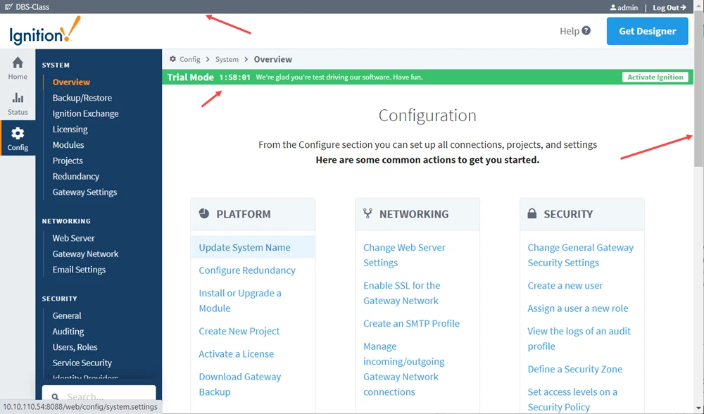

**Table of Contents**

|[Documentation Workflow](/index.md)|  |
|--|--|
|[User Manual Update Guide](/user-manual-update-guide/user-manual-update-guide.md)|<li>[Branching and Page Updates](/user-manual-update-guide/branching-and-page-updates.md)</li><li>[Ignition Updates Board](/user-manual-update-guide/ignition-updates-board/ignition-updates-board.md)</li><ul><li>[Planning Meetings and IGN Issue Review](/user-manual-update-guide/ignition-updates-board/planning-meetings-and-ign-issue-review.md)</li><li>[Internal Version and Complete Changelogs](/user-manual-update-guide/ignition-updates-board/internal-version-and-complete-changelogs.md)</li></ul><li>[Writing Tasks Board](/user-manual-update-guide/writing-tasks-board.md)</li><li>[Deprecated Pages](/user-manual-update-guide/deprecated-pages.md)</li><li>[User Manual Versioning](/user-manual-update-guide/user-manual-versioning.md)</li>|
|[User Manual Style Guide](/user-manual-style-guide/user-manual-style-guide.md)|<li>[Structure and Navigation](/user-manual-style-guide/structure-and-navigation.md)</li><li>[Formatting Guidelines](/user-manual-style-guide/formatting-guidelines.md)</li><li>[Style Conventions](/user-manual-style-guide/style-conventions.md)</li><li>[Syntax for Functions](/user-manual-style-guide/syntax-for-functions.md)</li><li>[Images](/user-manual-style-guide/images.md)</li><li>[Word List](/user-manual-style-guide/word-list.md)</li> |
|[Tips and Tricks](/tips-and-tricks/tips-and-tricks.md)|<li>[CheatSheets](/tips-and-tricks/cheatsheets/cheatsheets.md)</li><ul><li>[Drivers](/tips-and-tricks/cheatsheets/new-drivers.md)</li></ul><li>[Documentation Permalinks](/documentation-permalinks.md)</li>|

# Images

The use of images makes difficult and complex concepts easier to understand and enhances the learning experience. You can complement procedural instructions with screenshots, show examples of configuration settings and error messages, and of course, design components to only mention a few. All included images should add clarity to the concept you are writing about and be captured in a way that focuses on what the user needs to know.

Here are a few things to look out for:

* Grainy images which will make for an unclear image.
* Image is too small and, therefore, you cannot read the text or see the image clearly.

## Screen Capture Tools
There are number of screen capture tools available that can be used to take screenshots. With these tools, you can create a screenshot of the whole screen or a portion of the screen. 

* Snagit - Screen capture program that also includes a host of editing tools (recommended).
* Snipping Tool - Desktop app that also lets you do some light editing.
* ShareEx - Screen capture program for animated GIFs.
* Windows has a few built-in keyboard short cuts, but you will need to save the screenshot to the clipboard and use a program like Paint to do some basic editing.
    * Press Ctrl + PrtScn keys 
    * Windows + Print Screen
    * Alt + PrtScn

### Snagit Tips
There are several advantages to using Snagit. Here are a few features that we use regularly. 

* Time Delay setting - Use the time delay setting to delay the start of the capture. This gives you time to select a component, function, or option from a dropdown list that you wouldn't otherwise be able to.

* Capture Cursor - We use highlight boxes and arrows to point to information in our screenshots. Turn off the Capture Cursor option so that Snagit does not include the cursor in your screen capture.

    

## Image Types

### Screenshots
The following are our general guidelines for screenshots: 

* Capture what is essential to communicate the information. Headers, footers, and scrollbars can usually be omitted from images.
* Images should be smaller than 1000pixels
* Save images as Portable Network Graphic (.png) type. (Note that animated gifs are saved as .gif type.)

Do not include the following: 

* IP Addresses
* Project names
* Tools we use at IA, such as 1Password
* Scrollbars
* Trial Mode banner

When you can't avoid capturing these things in the image, use Snagit tools to edit them out of the image. For example, draw a rectangle over the IP Address then fill it with a color that matches the background (use the eyedropper tool to select the correct color.)

Here's is an example of an image with a few items we don't want to include: 

And here is the edited version.

#### Highlighting Information in Images

We often highlight buttons or other information on a screenshot, especially in procedures. The settings for the shape tool are set as follows:

* Red box (color #FC4242)
* 3px wide
* No shadow. This is a default setting in Snagit, so be sure to remove it.

Here is a screenshot example using highlight boxes.

Occasionally a box won't work for pointing out a detail. In that case we often use a red arrow, with similar settings to the box:

* Arrow (color #FC4242)
* One end with arrow, the other end plain (not rounded)
* 3px wide
* No shadow

For example, in the following image we're showing that the user will drag tags over to the OPC/Group Items list.

### Icons
In procedures we often use the icon name and an 18x18px image of the icon. 

Example:

1. Click the Binding  icon next to the text property.
2. Select the Property binding type. 
3. Click the Property Editor  icon.

### Illustrations and Other Images
We occasionally have graphic images in the User Manual that are not screenshots, but rather are illustrations or sometimes logos and images from our Marketing department. For example, the logos for all of the Ignition Modules come from Marketing. The architecture illustrations were also created by Marketing.

### Animated GIF Images
Animated GIFs can also be used in the User Manual, although, we use them sparingly. They are primarily used to show how more complex components (often Perspective components) work. 

Things to keep in mind when capturing animation:

* As with static images, only capture what is essential to communicate the information.
* Practice the example actions you're going to capture a few times to streamline mouse movement and number of clicks you need to use. 
* Keep mouse movements smooth. 

Click [here](https://www.docs.inductiveautomation.com/docs/8.1/appendix/components/perspective-components/perspective-display-palette/perspective-dashboard) to see an animated GIF from the User Manual. The main image is an animated GIF that shows resizing a widget, moving a widget, and toggling edit mode. 

## Saving Image Files

Before saving any images for a User Manual page, you'll need to create an images folder for that page. This will keep the folder structure in VS code clean and easy to navigate.

Once all edits are made to captured images and they are ready for the User Manual, save them as image1.png, image2.png, etc as they will appear on the page. 

Icons can be saved by the name of the tool. 

## Inserting Images 
Once you've saved your image in the local User Manual page folder, it will be available in VS Code. 

To add the image to a page:

1. Copy and paste the image from the sidebar list to the page location it needs to be inserted.
2. Fill in the required [alt-text](#alt-text) or remove the placeholder alt-text to leave empty brackets. 
3. Make sure there is an extra space above and below the image.
4. Make sure the image is indented to the correct level for where in the text it's been placed. 

:::note
If any images are removed or replaced on a page, be sure to also remove the outdated .png file from the image folder. 
:::

### Alt-Text
The most common image type we use for our User Manual content are considered decorative. Decorative images don’t need alt text. They exist on the page for purely aesthetic reasons to help users visualize a function, or they repeat information that is already on the page as text. Adding alt-text to decorative images is redundant. 

Informative images, on the other hand, convey some kind of information. If the reader would be missing information if the image were gone, then it means the image is informative and needs alt-text. The following are some general guidelines for alt-text:

* Do not include "picture of" or "image of" in descriptions.
* In general, avoid descriptions longer than 100 characters if possible.
* Images solely of text should contain the same text in alt attribute.

Tools for testing: https://accessibility.huit.harvard.edu/tools