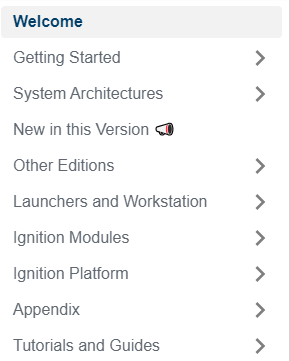
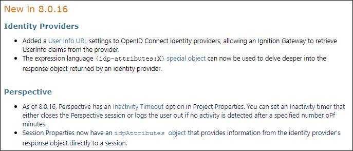

**Table of Contents**

|[Documentation Workflow](/index.md)|  |
|--|--|
|[User Manual Update Guide](/user-manual-update-guide/user-manual-update-guide.md)|<li>[Branching and Page Updates](/user-manual-update-guide/branching-and-page-updates.md)</li><li>[Ignition Updates Board](/user-manual-update-guide/ignition-updates-board/ignition-updates-board.md)</li><ul><li>[Planning Meetings and IGN Issue Review](/user-manual-update-guide/ignition-updates-board/planning-meetings-and-ign-issue-review.md)</li><li>[Internal Version and Complete Changelogs](/user-manual-update-guide/ignition-updates-board/internal-version-and-complete-changelogs.md)</li></ul><li>[Writing Tasks Board](/user-manual-update-guide/writing-tasks-board.md)</li><li>[Deprecated Pages](/user-manual-update-guide/deprecated-pages.md)</li><li>[User Manual Versioning](/user-manual-update-guide/user-manual-versioning.md)</li>|
|[User Manual Style Guide](/user-manual-style-guide/user-manual-style-guide.md)|<li>[Structure and Navigation](/user-manual-style-guide/structure-and-navigation.md)</li><li>[Formatting Guidelines](/user-manual-style-guide/formatting-guidelines.md)</li><li>[Style Conventions](/user-manual-style-guide/style-conventions.md)</li><li>[Syntax for Functions](/user-manual-style-guide/syntax-for-functions.md)</li><li>[Images](/user-manual-style-guide/images.md)</li><li>[Word List](/user-manual-style-guide/word-list.md)</li> |
|[Tips and Tricks](/tips-and-tricks/tips-and-tricks.md)|<li>[CheatSheets](/tips-and-tricks/cheatsheets/cheatsheets.md)</li><ul><li>[Drivers](/tips-and-tricks/cheatsheets/new-drivers.md)</li></ul><li>[Documentation Permalinks](/documentation-permalinks.md)</li>|

# Structure and Navigation

The User Manual provides multiple ways to navigate quickly and easily through Ignition's many pages, appendix, videos, and more:

* The Table of Contents on the left navigation bar allows users to directly access different sections and pages.
* The Search feature suggests pages as a user enters a combination of letters and words. It also provides an expanded view of all the search results meeting the user's search criteria. 
* The header list on the upper right side of individual pages take users directly to sub-section when clicked.
* Previous and Next arrow cards on the bottom of the page take users to the corresponding pages. 
* Links within text on a page take users to related topics that may be of interest. 
* Inductive University cards take users to the linked video.  
* KBA cards take users to the linked KBA page.  

:::tip
The Tips and Tricks page details how to use add links and IU video and KBA cards. 
:::

## Table of Contents Organization 

The User Manual's page structure is displayed on the left side of each page and serves as the table of contents for the manual. The User Manual has a tiered page structure. Caret  symbols next to a page denote that there are nested pages. Expand the caret and you will see the nested pages. Some of the nested pages will also have a caret  symbol next to them denoting more nested pages. For clarity, think of a page that has a caret as a Section and all the pages under that section as children or sub-sections. Pages at the top are more general in nature, and as you expand each page the information becomes more granular.

### Major Sections

The User Manual is organized into nine major sections, each providing in-depth information on Ignition:

1. **Welcome**   
    This top page of the User Manual serves as an introduction and states the purpose of the User Manual

2. **Getting Started**   
    The Getting Started section describes how to install, upgrade, and activate Ignition. It also contains the Startup Guides which help users get started quickly with a Perspective Session and Vision Client. This section also provides an overview for the Ignition Modules.

3. **System Architectures**   
    This section describes different System Architecture scenarios. Graphics are managed by Marketing.  

4. **New in this Version**   
    The New in this Version (NITV) page lists brief descriptions of the updates that impact users for each minor Ignition release and Perspective Mobile App update.   

5. **Other Editions**   
    Specific information about the Ignition Edge, Maker Edition, and Cloud Edition is maintained here. 

6. **Launchers and Workstation**   
    The Launchers and Workstation section describes how to download and install the Designer Launcher, Perspective Workstation, and Vision Client Launcher applications. These three applications must be downloaded, installed and configured separately. 

7. **Ignition Modules and Platform**   
    The Modules and Platform sections are packed with a lot of information, examples, and screenshots that demonstrate how to integrate modules seamlessly into the system to provide design workspaces, reporting, alarm configuration, interface to SQL databases, new drivers, and much more.

    * The Ignition Modules section describes in detail each of the Ignition modules: Vision, Perspective OPC UA, Tag Historian, Reporting, and Alarm Notification to name a few. It describes in detail how to use the modules to build a customized system. 

    * The Ignition Platform is the core installation of Ignition. It provides all the basic functionalities such as connecting to devices and databases, licensing, launching clients and sessions, managing all Ignition modules, and more.

8. **Appendix**   
    The Appendix contains component pages, Expression and System Function pages, Reference pages, and Legacy Documentation. See the [Appendix](#appendix) breakdown below for more information on what these sections include and formatting assistance.  

9. **Resource Guides**   
    The Resource Guides section is a catch-all for Tutorials, helpful tricks, and links to guides on specific tasks. For maintenance purposes, it is recommended that we link to guides externally instead of migrating guides into the User Manual. 

## New in this Version Page Structure

Over the course of development, there will be changes, improvements, fixes, and new functions and features introduced to the Ignition software. The [New in this Version](https://www.docs.inductiveautomation.com/docs/8.1/new-in-this-version) page shows all the current Ignition releases for the major version. Each version highlights new functionality or modified behavior with a brief description of the change, including links to the page where new content was added for the user to read more.

Each major Ignition release is its own separate user manual and has its own New in this Version page. The different user manual versions of Ignition can be found using the dropdown on the top navigation bar or on the [Legacy Documentation](https://www.docs.inductiveautomation.com/docs/8.1/appendix/legacy-docs) page. 

### Page Layout

Each Ignition version listed in the New in this Version page has it own title using a level 2 header which is automatically captured by the page contents list on the upper right side of the page. Users can click the minor version links to go directly to that version on the page to see a brief description of updates and changes. Bug fixes are not included on the New in this Version page updates. 

At the top of the page is an IU video with an overview of the updates for the most current major version of Ignition (i.e., 8.1). Users can see what's new by clicking the **Watch the video** link. 

Updates to the manual are organized in bulleted lists under level 3 headers that group changes by common functions. Each Ignition version is separated by a blank section to create spacing between each version. For example:

## Appendix
The Appendix section contains five independent sections: Components, Expression Functions, System Functions, Reference Pages, and Legacy Documentation. The Appendix pages have a different layout than other sections of the manual. Each section layout describes each component, expression function and system function, and they all include examples. For the expression and system functions, there is a syntax section showing how to construct each function.

### Component Pages
The Component pages of the Appendix are organized into three sections: [Perspective](https://www.docs.inductiveautomation.com/docs/8.1/appendix/components/perspective-components), [Vision](https://www.docs.inductiveautomation.com/docs/8.1/appendix/components/vision-components), and [Report Design](https://www.docs.inductiveautomation.com/docs/8.1/appendix/components/report-design-components). The parent pages are organized by component palette. Each time a new component is added or removed, the parent page is automatically updated by the `DocCardList`. Each component listed on the parent page is linked to the component page. Each component page displays an image of the component and contains a description, a properties table, and an example showing how the component can be used. 

Here are some guidelines to follow when creating new content, or updating existing content on a Component Reference page:
 * The top of the page should include an image or gif of the component and an image of the component palette icon, followed by the Description section.
 * Description: A couple sentences summarizing the component and any important notes to highlight to users.
 * Properties:  Add a table for identifying and describing the component's properties. The number of columns in the Properties Table vary for each module. Here's a list of column names for each module:
    * Perspective: Name, Description, and Property Type
    * Vision: Name, Description, Property Type, Scripting, and Category
    * Report Design: Property and Description

    :::note
    Some component pages may include a **User Interface** section to highlight the interface elements of the component with an image and table describing icon functions.
    :::
* Component Events: This section contains a description about Perspective Component Events. This description is the same for every Perspective component page. 
* Scripting: This section links a user to the Scripting subpage that details the Scripting Functions, Extension Functions and Event Handlers. Even if the component does not have one of these functions, the header should still be included to state that. 
* Customizers: Vision components might have an additional section for Customizers. The Customizer section could include links to the Vision Component Customizers page or the Style Customizer section. Not all components have a Customizer. If the component has a separate customizer, create the section needed to describe it. 
* Examples: The final section for all component reference pages contain examples of how to use the component. Show a working example of the component, and create a two column table showing the properties and their values under the working example if needed. 

Look through the User Manual Component Reference pages for current examples of layout and formatting. 

### Expression Function Pages
The Expression Functions section of the Appendix identifies all the built-in Expression Functions in Ignition. Each page describes a specific Expression Function and how it is used under three headers: **Description**, **Syntax**, and **Examples**.

Here are some guidelines to follow when creating new content for an Expression Function's page:

* Start each page with the following sentence: **This function is used by Ignition's Expression language.**
* Description: Enter a description of the expression function.
* Syntax: In bold, enter an example of the expression function showing the syntax. This section contains:
    * Parameters - Identify any parameters that can be used with the expression function.
    * Results - Identify what results the function will return, if anything.
* Examples: Make sure to number code snippet examples or give titles so they can be easily referenced. 

### System Functions Pages
The Systemg Functions section of the Appendix lists all the Scripting Functions available inside of Ignition. Each page describes the specific System Function and how it is used under five headers: Description, Client Permission Restrictions, Syntax, Code Examples, and Keywords

Here are some guidelines to follow when creating new content for a Scripting Function page:
* Start each page with the following sentence: This function is used in **Python Scripting**.
* Description: Enter a description of the scripting function.
* Client Permission Restrictions: If the scripting function has any client permission restrictions, enter the Permission Type. If there are no restrictions enter the following sentence: This scripting function has no [Client Permission](https://www.docs.inductiveautomation.com/docs/8.1/ignition-modules/vision/vision-project-properties#vision-permissions-properties) restrictions. 
* Syntax: In bold, enter an example of the scripting function showing the syntax in code formatting. This section contains:
    * Parameters - Identify any parameters that can be used with the scripting function, if anything.
    * Returns - Identify what the scripting function will return, if anything. 
    * Scope - Identify what scope the scripting function work: Gateway Scope, Vision Client, and Perspective Session.
* Examples: Make sure to number code snippet examples or give titles so they can be easily referenced. 
* Keywords: Enter keywords to assist the user with searching the user manual for scripting functions.

### Reference Pages
This section is for various reference pages that may fall outside of a specific section in the User Manual. Content that cover information beyond Ignition should instead be placed or linked in the Resource Guides section.  

For instance, pages in the Reference section include: 

* Gateway Configuration File Reference - Describes available changes to the Gateway's configuration file, `ignition.conf`, with pages containing information about the Gateway, Gateway Network, Perspective, and Vision Client parameters and system properties. 
* The Color Selector, Style, and Symbol pages that are linked in many component pages. 

### Legacy Documentation

The PDFs available for download in this section have reached end of life and are no longer supported. These documents are not actively maintained, but are provided as a resource. Although, the existing content in the Deprecated Pages section is not actively maintained, new content will continue to be added to maintain backwards compatibility. 

See the [Deprecated Pages](../user-manual-update-guide/deprecated-pages.md) section of the Update Guide to learn more about when adding content to the Deprecated Pages is necessary. 

## Top Navigation Bar 

The top navigation bar includes additional links:
* **SDK Guide** - Includes instruction for using the Ignition Software Development Kit to build modules, example projects, and Javadocs links.
* **Resources** - Links to resources that provide valuable information to our users: 
    * Inductive University
    * Ignition Demo Project
    * Ignition Exchange
    * Knowledge Base Articles
    * Forum
    * IA Support
* **Partners Links** - Links to Ignition's strategic partners as a quick reference to their product user manuals. Current partners include Sepasoft: MES Modules and Cirrus Link: MQTT Modules.  
* **All Manual Versions** - Training maintains previous Ignition versions for those users who have not upgraded to the latest version of Ignition. As of this writing, we are maintaining the following versions of the Ignition User Manual: 
    * Ignition 8.1
    * Ignition 7.9
