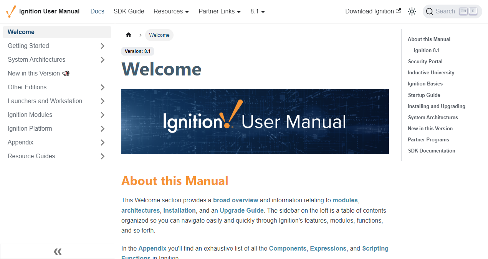

**Table of Contents**

|[Documentation Workflow](/index.md)|  |
|--|--|
|[User Manual Update Guide](/user-manual-update-guide/user-manual-update-guide.md)|<li>[Branching and Page Updates](/user-manual-update-guide/branching-and-page-updates.md)</li><li>[Ignition Updates Board](/user-manual-update-guide/ignition-updates-board/ignition-updates-board.md)</li><ul><li>[Planning Meetings and IGN Issue Review](/user-manual-update-guide/ignition-updates-board/planning-meetings-and-ign-issue-review.md)</li><li>[Internal Version and Complete Changelogs](/user-manual-update-guide/ignition-updates-board/internal-version-and-complete-changelogs.md)</li></ul><li>[Writing Tasks Board](/user-manual-update-guide/writing-tasks-board.md)</li><li>[Deprecated Pages](/user-manual-update-guide/deprecated-pages.md)</li><li>[User Manual Versioning](/user-manual-update-guide/user-manual-versioning.md)</li>|
|[User Manual Style Guide](/user-manual-style-guide/user-manual-style-guide.md)|<li>[Structure and Navigation](/user-manual-style-guide/structure-and-navigation.md)</li><li>[Formatting Guidelines](/user-manual-style-guide/formatting-guidelines.md)</li><li>[Style Conventions](/user-manual-style-guide/style-conventions.md)</li><li>[Syntax for Functions](/user-manual-style-guide/syntax-for-functions.md)</li><li>[Images](/user-manual-style-guide/images.md)</li><li>[Word List](/user-manual-style-guide/word-list.md)</li> |
|[Tips and Tricks](/tips-and-tricks/tips-and-tricks.md)|<li>[CheatSheets](/tips-and-tricks/cheatsheets/cheatsheets.md)</li><ul><li>[Drivers](/tips-and-tricks/cheatsheets/new-drivers.md)</li></ul><li>[Documentation Permalinks](/documentation-permalinks.md)</li>|

# User Manual Style Guide

The purpose of this style guide is to establish a consistent editorial style for the Ignition User Manual, as well as make sure the manual adheres to corporate standards and delivers content in a clear manner for our users.

One of the missions of the Docs Department is to provide information in the User Manual that not only describes Ignitions functionality but also guides users on how to use Ignition so they can create and enhance their own projects rapidly. This is done through descriptions, step-by-step procedures, examples, and reference pages. We make extensive use of links within the manual, detailed screenshots taken directly from Ignition, and even outside resources to enhance the text. 

This style guide provides guidelines on the overall organization, page format and layout, code blocks, custom links, versioning, and much more. This is a living document, so it will be updated and edited as needed. Standardizing the User Manual to this style guide is an on-going process. When pages are edited for technical content updates, style is checked as well.

Documenting Ignition is a huge task, especially since its feature set is already so robust, and it changes by the day. To manage such a large task, we must:

1. Research and learn about a subject.
2. Recognize what the audience needs to know and focus content accordingly.
3. Make the content easy to comprehend, visually appealing, and searchable.
4. Consider everything a draft and update relentlessly.
5. Make contribution simple.

## Basic Functional Documentation

The core idea of Basic Functional Documentation is taken from Andrew Etter's [Modern Technical Writting](https://www.amazon.com/Modern-Technical-Writing-Introduction-Documentation-ebook/dp/B01A2QL9SS). 

Below are some questions regarding Basic Functional Documentation that our documentation needs to answer. 

### What is the feature/product? Why would anyone want it?
With technical writing, it's easy to get caught up how, more so than what or why. However, if you can't answer these questions for yourself, you need to go back to researching it more. Note that "researching" can also be a conversation with a subject matter expert, or the implementing developer or QA.

New features are typically initiated by user request, which is usually included on the development ticket. This information helps us understand what the use case is, or how the new feature solves a problem. We can and should include this information in our documentation in some way.

### How does this feature/product fit into a broader ecosystem, if at all? Does it have any dependencies?
The answer here can be a single sentence, a diagram, or an in-depth explanation of all the moving pieces. In short, our users need to know what other dependencies they'll need before they can utilize a product or feature.

In a way, this is fairly easy for us to answer at a higher level. Ignition is a platform that has some core functionality. Users can add modules to the platform that provide additional functionality. A feature is either going to be in the platform, or require a module. This may seem implied based on where content is located in the manual, but it's still helpful to be explicit and state requirements for a feature, especially in cases where a feature can leverage multiple modules. For example, a Chart component would be in a visualization module (like Perspective) and probably make use of some other module that could retrieve data from a database (such at Tag Historian). 

At a lower level, we get to the point where a different configurations of a feature can do different things depending on what the user does. If a component gained some new functionality, we need to be able to answer the following questions:
* How does it change from the previous functionality? 
* What makes it unique?
* Does the addition of this new functionality deprecate any other feature? 

### How do I install the product? What are the basic configuration options, if any?
Our installation documentation answers the first question. 

To answer the second question, we need to make sure we have explanations for settings users can find in-product. These are usually easy enough to find with new features. Development may have even included some tooltips in-product, or provided a description of the settings in their ticketing system. If not, asking the implementing developer or QA engineer who tested the feature can answer these questions. 

### What does a simple, start to finish operation look like?
This can be anything from a procedural walkthrough to a functional code example. Note that we must require explanation comments with functional code examples, not just the code snippet.

The point of this step is to take a user from nothing to something. If it's a simple feature, sometimes this means we just need a description of the feature and that's it. 

