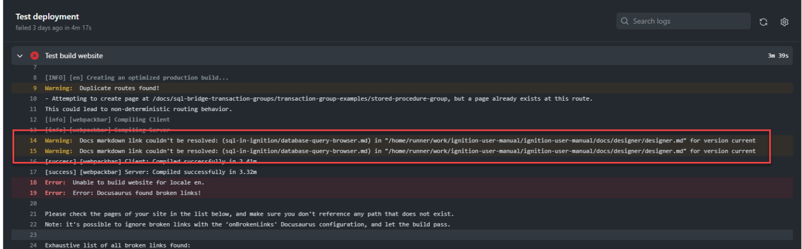

**Table of Contents**

|[Documentation Workflow](/index.md)|  |
|--|--|
|[User Manual Update Guide](/user-manual-update-guide/user-manual-update-guide.md)|<li>[Branching and Page Updates](/user-manual-update-guide/branching-and-page-updates.md)</li><li>[Ignition Updates Board](/user-manual-update-guide/ignition-updates-board/ignition-updates-board.md)</li><ul><li>[Planning Meetings and IGN Issue Review](/user-manual-update-guide/ignition-updates-board/planning-meetings-and-ign-issue-review.md)</li><li>[Internal Version and Complete Changelogs](/user-manual-update-guide/ignition-updates-board/internal-version-and-complete-changelogs.md)</li></ul><li>[Writing Tasks Board](/user-manual-update-guide/writing-tasks-board.md)</li><li>[Deprecated Pages](/user-manual-update-guide/deprecated-pages.md)</li><li>[User Manual Versioning](/user-manual-update-guide/user-manual-versioning.md)</li>|
|[User Manual Style Guide](/user-manual-style-guide/user-manual-style-guide.md)|<li>[Structure and Navigation](/user-manual-style-guide/structure-and-navigation.md)</li><li>[Formatting Guidelines](/user-manual-style-guide/formatting-guidelines.md)</li><li>[Style Conventions](/user-manual-style-guide/style-conventions.md)</li><li>[Syntax for Functions](/user-manual-style-guide/syntax-for-functions.md)</li><li>[Images](/user-manual-style-guide/images.md)</li><li>[Word List](/user-manual-style-guide/word-list.md)</li> |
|[Tips and Tricks](/tips-and-tricks/tips-and-tricks.md)|<li>[CheatSheets](/tips-and-tricks/cheatsheets/cheatsheets.md)</li><ul><li>[Drivers](/tips-and-tricks/cheatsheets/new-drivers.md)</li></ul><li>[Documentation Permalinks](/documentation-permalinks.md)</li>|

# Branching and Page Updates

When editing existing pages in the manual, writers will need to create a new branch in the [Inductive Automation Ignition User Manual GitHub Repo](https://github.com/inductive-automation/ignition-user-manual). When branch updates are reviewed and approved, they will be merged into the internal `staging` branch. The `staging` branch is then merged to the `main` public branch weekly. 

In addition to describing the branching process,tThis page also covers validating incoming and outgoing links, and the page review and publish process. 

## Branching 

Branching allows writers to make page changes and updates that are hidden from users until they are reviewed or otherwise ready to be made public. This way, the original page is still viewable to users while the new updates are hidden on the branches WIP pages until changes are merged into the main branch. In addition to providing a simple way to share and track changes for weekly changes or smaller corrections, branching makes it possible for a writer to get a early start writing new content when development isn't quite finalized. New content may also warrant new page creation or restructering and typically requires multiple editing sessions. 

All branches must have a related DOC card. If a DOC card does not already exist, create your own on the applicable Ignition Updates or Writing Tasks board and include a general overview of intended changes and a link to the affected page or pages.

Branches can be created either on the GitHub site or in your GitHub Desktop.

To create a branch on the GitHub site:

1. Access the [Ignition User Manual GitHub Repo Branches](https://github.com/inductive-automation/ignition-user-manual/branches) page.
2. Select **New branch**.
3. Enter the branch name, starting with the writer's first intial and last name followed by DOC card number and title.
4. Select `staging` as the branch source.
5. Click **Create new branch**. 

To create a branch in GitHub Desktop:

1. Select `staging` as the Current branch.  
2. Select **Branch** from the top bar. 
3. Select **New branch**.
4. Enter the branch name, starting with the writer's first intial and last name followed by DOC card number and title.
5. Click **Create branch**. 

Regardless of method, the new branch will now be available to open and edit in Visual Studio Code (VSC). 

### Using Visual Studio Code

:::note Text Editor Preferences
Different text editors, like Sublime Text or similar, can still be used to open and edit pages. Visual Studio Code is currently the recommended editor and all examples from this point forward will be using VSC
:::

When you first open a branch in VSC, you'll see the Ignition User Manual folder structure in the left-hand Explorer panel. Use the `docs` dropdown to locate the 8.1 page or pages that need work. If you are editing a page from a previous version of the manual, locate the `version_docs` dropdown further down the page to select an older version of the docs. The 7.9 version of the manual is currently the only other version actively maintained. 

The structure matches the published User Manual navigation panel, so you can either follow the URL to quickly find a page or use the search bar in the top center of VSC. 

:::note
Be aware that the search bar will locate any file with the page name, not necessarily listing them in order of the latest manual version. If the 7.9 version has the same name as an 8.1 version page, they will both populate, so make sure to select the relevant file.
::: 

Make all necessary changes following the [User Manual Style Guide](../user-manual-style-guide/user-manual-style-guide.md). Changes can be previewed for self-review using the `docusaurus start` command in lower left NPM Scripts panel. The Run arrow will become visible when hovering over the start function. Select it to start an local build. The local build will display all changes made as they will appear when published. The only feature that will not function properly is the search feature since the search results do not update to find local changes.

Save and commit changes when page edits are finished. You'll need to enter a short summary of updates that clearly relay changes made as the description will be available to view by all users. 

For more information on editing pages in VSC, refer to the Tips and Tricks page. 

## Validating Incoming and Outgoing Links

A major feature of the User Manual is how links seamlessly connect content from different pages. In such a large document, it's essential to have multiple ways to help users quickly locate the information they need. Users can accomplish this on their own through the search feature, but writers can offer additional options by providing valid links to separate user manual sections or IU videos on related subjects for additional context that would otherwise overload the current page. 

Updating the User Manual is the most common way links may be broken. Docusaurus build checks and subsequent PR checks will fail if links are broken to internal pages, but external links all need to be manually tested to verify they take users to the correct location. External links include IU videos. 

:::tip
If a page title needs to change, update using the `title:` front matter instead of the .md file name to prevent breaking links to that page. 
:::

It's the original writer's responsibility to verify all links on their pages. Reviewers will then double-check all links take users to the intended location and update as necessary. 

If an internal link is broken, it will show an error message similar to the following that instructs where the broken link exists. Navigate to that page and link to correct it. If working in VSC, and broken links are caused by moving page hierarchy locations, you may have to restart your local host run for the corrections to appear. 

Links broken by changing URL paths may impact permalinks. Refer to the [Documentation Permalinks](../documentation-permalinks.md) page for more information on updating permalink destination URLs.

## Creating a Pull Request from GitHub Desktop

Committed changes are reviewed through pull requests and the first commit will trigger the option to preview and create a pull request. Any further changes or edits made will be added to the existing PR with a new line describing the update. 

1. Click **Preview Pull Request** on the main GitHub Desktop page. 
2. Change the base branch from `main` to `staging` or the version `8.1.XX` branch, based on the type of change being made. 
3. Click **Create pull request**. This will open a new page on the Ignition User Manual GitHub Repo. 
4. Verify the correct banch is selected for the merge location, and enter any relevant title or description text. 
5. Click **Create pull request**. 
6. Make sure your PR passes all tests and checks, returning a green check. Note that merge conflicts need to be resolved before checks will run.
    * If your check fails, you can click the failed `X` symbol on the main PR page and access the Details link for the Test deployment. This will open the error logs for you to use for guidance in correcting any issues.

    :::note
    The Test deployment check will take 15-30 minutes depending on the size of the PR and the connection speed.
    :::

Now your PR is ready for review. The PR link should be copied and pasted as a comment in the related DOC Card and the ticket state moved to Ready for Review. To learn more about the DOC card phases, refer to the [Update Guide Doc Card Phases](user-manual-update-guide.md#doc-card-phases). 

## Deleting Branches
Since the last step before merging PRs is to have another Doc team member review updated pages, it's the reviewers responsibility to merge the PR into the `staging` or `version` branch. Now that the changes have been merged, the branch opened for the DOC Card needs to be deleted and the DOC Card moved to the Passed Review state. 

Select the **Delete branch** option that appears after a PR is merged to close and remove the branch. If a branch is accidently deleted, select the **Restore branch** option that has replaced the Delete branch option to open it again. 

