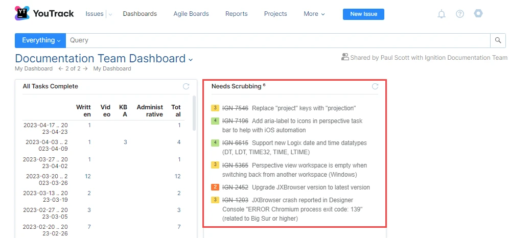
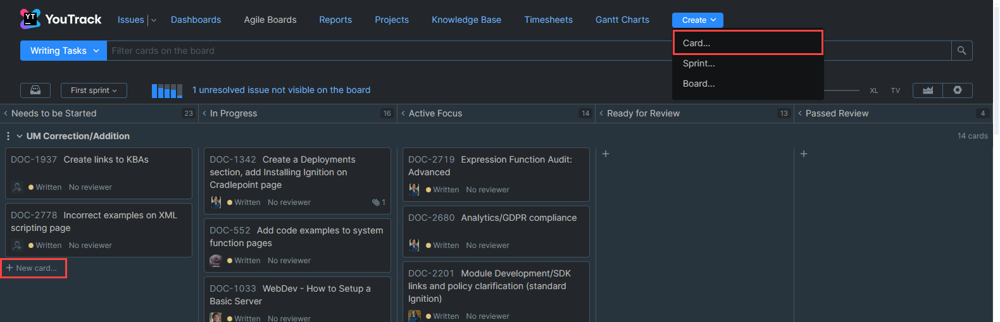
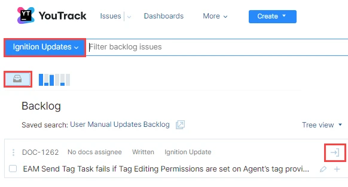
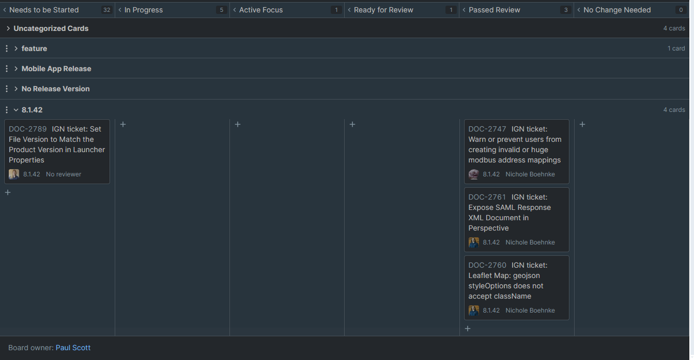

<details>

<summary>**Table of Contents**</summary>

|[Documentation Workflow](/index.md)|  |
|--|--|
|[User Manual Update Guide](/user-manual-update-guide/user-manual-update-guide.md)|<li>[Branching and Page Updates](/user-manual-update-guide/branching-and-page-updates.md)</li><li>[Ignition Updates Board](/user-manual-update-guide/ignition-updates-board/ignition-updates-board.md)</li><ul><li>[Planning Meetings and IGN Issue Review](/user-manual-update-guide/ignition-updates-board/planning-meetings-and-ign-issue-review.md)</li><li>[Internal Version and Complete Changelogs](/user-manual-update-guide/ignition-updates-board/internal-version-and-complete-changelogs.md)</li></ul><li>[Writing Tasks Board](/user-manual-update-guide/writing-tasks-board.md)</li><li>[Deprecated Pages](/user-manual-update-guide/deprecated-pages.md)</li><li>[User Manual Versioning](/user-manual-update-guide/user-manual-versioning.md)</li>|
|[User Manual Style Guide](/user-manual-style-guide/user-manual-style-guide.md)|<li>[Structure and Navigation](/user-manual-style-guide/structure-and-navigation.md)</li><li>[Formatting Guidelines](/user-manual-style-guide/formatting-guidelines.md)</li><li>[Style Conventions](/user-manual-style-guide/style-conventions.md)</li><li>[Syntax for Functions](/user-manual-style-guide/syntax-for-functions.md)</li><li>[Images](/user-manual-style-guide/images.md)</li><li>[Word List](/user-manual-style-guide/word-list.md)</li> |
|[Tips and Tricks](/tips-and-tricks/tips-and-tricks.md)|<li>[CheatSheets](/tips-and-tricks/cheatsheets/cheatsheets.md)</li><ul><li>[Drivers](/tips-and-tricks/cheatsheets/new-drivers.md)</li></ul><li>[Documentation Permalinks](/documentation-permalinks.md)</li>|

</details>

# Planning Meetings and IGN Issue Review

The Writing Team Planning meeting is held weekly to review Merged & Closed IGN issues, dicuss team member capacity, and share team announcements. The meeting is hosted on Google Meet and led by a rotating meeting presenter. The presenter role cycles through all team members on a weekly basis.

## IGN Issue Review

The goal of ticket review is to determine the implications of the change, and figure out how that can impact our users, if at all. The meeting presenter is responsible for running a review of the current Merged & Closed issues sorted to the [Documentation Scrub](https://youtrack.ia.local/search/Documentation%20Scrub-85) list. The entire team discusses the initial findings to confirm whether an IGN issue receives a **docs** or **no-docs** tag and if the related release note is approved as written. The Documentation Engineer records any required release note changes so they are properly implemented in the [Internal Version Changelog](internal-version-and-complete-changelogs.md).

### Searching YouTrack for IGN Issues
The number of IGN issues will vary from meeting to meeting. A pre-defined search script is used to identify the IGN issues matching certain criteria. The Documentation Scrub search string is shown in the code block below:

```python title="Documentation Scrub Search String"
project: IGN State: {Merged & Closed} and ((tag: -no-docs ,-docs) or (tag: docs and has: -{Parent for} )) and Regression: -{Yes - Detected Prerelease} and Type: -Task order by: {issue id} desc
```

### Reviewing IGN Cards on the Documentation Team Dashboard

To open an IGN issue, click on an IGN number in the list. Each IGN card describes the change in detail and the work performed through the Description, Release Note, Type, System and Release Version sections. The Type indicates if the issue is a **Feature**, **Bug**, or **Refactor** change. As a guideline, features almost always require a docs tag. Tickets sorted as bugs or other types may also require a docs tag if the fix or change added new functionality or expanded upon an existing feature, which means we need to update the docs. 

Sometimes features are insignificant enough to not warrant a documentation update, such as cases where a developer adds a tooltip or description to something in-product (in both cases, we don't document those things).



Each IGN issue will be assigned one of the following tags: 

* **docs** - This tag is for new feature or function updates, or changes to item behavior that users need to be aware of.
* **no-docs** - This tag is for changes that are fixed in the background and do not affect the outward behavior of an item. These are mostly considered bug fixes. IGN issues tagged no-docs do not require a DOC card or an update to the user manual. 

To add a document tag on an IGN card, simply click the **Tag**  button and select the appropriate **no-docs** or **docs** tag from the dropdown. 



IGN issues that require a user manual update, and thus a `docs` tag, will have a DOC card added to the Ignition Updates YouTrack Board Backlog and a DOC card link is displayed under the Parent For list on the IGN card. 

#### Release Note
    
After establishing if the ticket impacts the docs or not, we also review the ticket's release note. Release notes should clearly state the ticket change in a single sentence. They should address the solution more than the cause or problem on why a change was needed. We also check to make sure that release notes don't contain too much superfluous information that should instead be covered in the User Manual update. 

If a ticket is missing a release note, verify there is a no release note tag, or add the ticket to the Release Note Review list to verify if that tag is needed or if a release note needs to be created. 

See the Internal Version and Complete Changelogs page for more information on [Release Note Reviews](internal-version-and-complete-changelogs.md#release-notes-review-meeting). 

### DOC Card Assignment
Once all IGN Issues from the queue are reviewed, the weekly presenter must move DOC cards from the Backlog space to the Version swimlane **Needs to be Started** column. This is done by accessing the [Ignition Updates Agile board](https://youtrack.ia.local/agiles/115-37/current), clicking the Backlog icon to expand the Backlog list, and clicking the arrow icon to move the cards to the correct swimlanes. They will be automatically sorted using the populated information from the original IGN issue.



:::note
YouTrack swimlanes track changes to specific released versions of the user manual. There may be several active YouTrack swimlanes available if Software Engineering is working on multiple software release versions at the same time. 

Swimlanes can be added and deleted by clicking the **Board Settings** icon > selecting the **Columns and Swimlanes** tab, and using the **Add value** or **Remove** options as needed per Swimlane Release Version. 
:::

The image below shows the entire documentation workflow process for the 8.1.42 swimlane, and the phase where each card will be located in the lifecycle. Notice that there are swimlanes that are not directly listed as a version: Uncategorized Cards, feature, Mobile App Release, No Release Version. 

* The Uncategorized Cards swimlane tracks DOC cards where the IGN issue is still in progress, but created by an SE for the purpose of adding content to an existing user manual page.
* The Mobile App Release is for changes specifically regarding the mobile app. These releases are on a less structured schedule. See the Mobile App Release section for more information. 

    