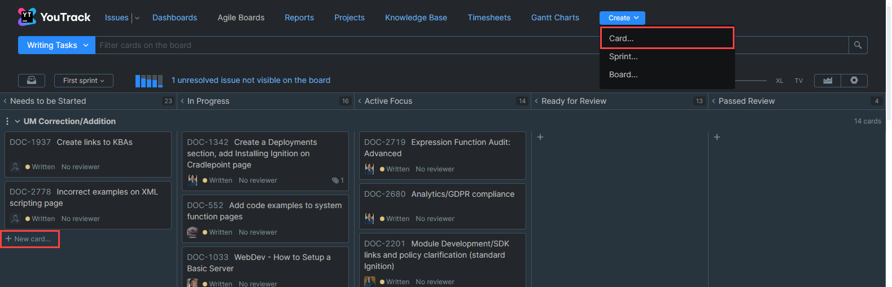
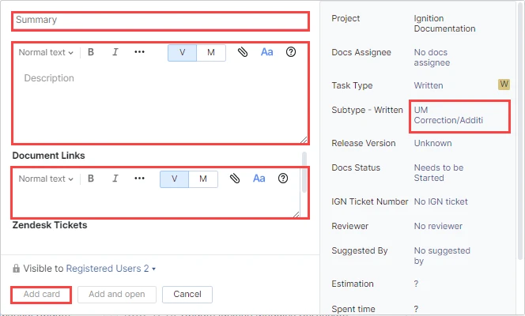
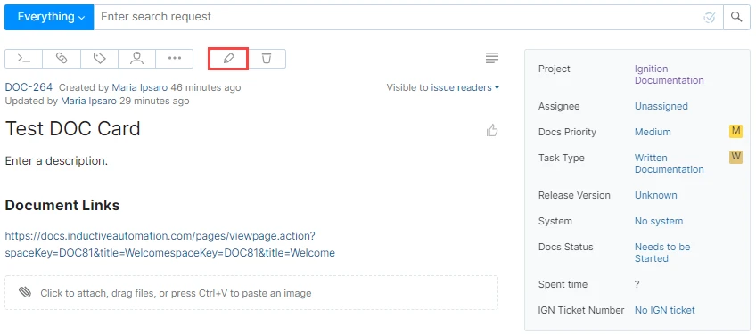

# Writing Tasks Board

The majority of DOC issues created for the Writing Tasks board are for the UM Corrections/Additions swimlane. These ticket requests expand, correct, or clarify existing content in the User Manual. These type of DOC issues follow a similar user manual update process as the Ignition Updates DOC issues, but can be published much faster since they are not dependent on a version release. 

Since suggestions for these type of DOC tickets come from many departments through various channels, it's important to include as much information as possible in the description of the DOC Card. Helpful information is to know relevant names to contact for more information, links to the original issue or suggestion (ie, slack channel or forum post).

The Writing Tasks board also includes other swimlanes like the KBA swimlane for Knowledge Base Article tasks, the SDK swimlane for Software Development Kit tasks, or temporary swimlanes created for larger projects that are better separated until completed.

## Creating DOC Issues on the Writing Tasks Board

On the Writing Tasks board in YouTrack, click on **Create** and select **Card** or **Select + New card...** in the related swimlane to start the process of adding a new DOC card. 

Selecting to create a new card opens a blank DOC issue. Enter a Title, Description and Document Links to the affected user manual pages. Make sure the Subtype - Written field displays the necessary DOC card swimlane. Note that the Subtype dropdown will show all available swimlanes, even from other Documentation boards. These types of changes are not required to be updated in a specific release version of the user manual, so the **Release Version** will be set to **Unknown**. After all the information is added, click **Add Card**.

Once created, the card will remain in the **Needs to be Started** column until a team member assigns their name to the card and moves the State to **In Progress**. The branch for the DOC Card is created by the writer who picks up the DOC Card and work has begun to ensure they are branching from the most recent version. For more information on branching, refer to the [Branching and Page Updates](branching-and-page-updates.md) section. 

## Editing a DOC Card
To edit a DOC card, click on the DOC number to open the card. Press the **Edit**  button at the top of the DOC card. All the fields on the DOC cards are editable. There is also a Comment field on the card where comments can be added, or if someone wants to send an email notification to another person. 

Since suggestions for these type of DOC tickets come from many departments through various channels, it's important to include as much information in the description of the DOC Card. Helpful information is to know relevant names to contact for more information, links to the original issue or suggestion (ie, slack channel or forum post)

## Closing a DOC Card
Once edits are complete, the writer needs to comment the link to the PR and move the DOC Card state to Ready for Review. The rest of the review and publishing steps follow the process described on the [User Manual Update Guide](user-manual-update-guide.md#doc-card-phases) page. 

After the `staging` branch is next merged to `main`, all related DOC Cards are moved to published. 

# [Documentation Workflow](/index.md) - **Table of Contents**

|[User Manual Update Guide](/user-manual-update-guide/user-manual-update-guide.md)|[User Manual Style Guide](/user-manual-style-guide/user-manual-style-guide.md)|[Tips and Tricks](/tips-and-tricks/tips-and-tricks.md)| 
|--|--|--|
|[Branching and Page Updates](/user-manual-update-guide/branching-and-page-updates.md) [Ignition Updates Board](/user-manual-update-guide/ignition-updates-board/ignition-updates-board.md)  - [Planning Meetings and IGN Issue Review](/user-manual-update-guide/ignition-updates-board/planning-meetings-and-ign-issue-review.md)  - [Internal Version and Complete Changelogs](/user-manual-update-guide/ignition-updates-board/internal-version-and-complete-changelogs.md) [Writing Tasks Board](/user-manual-update-guide/writing-tasks-board.md) [Deprecated Pages](/user-manual-update-guide/deprecated-pages.md) [User Manual Versioning](/user-manual-update-guide/user-manual-versioning.md)|[Structure and Navigation](/user-manual-style-guide/structure-and-navigation.md) [Formatting Guidelines](/user-manual-style-guide/formatting-guidelines.md) [Style Conventions](/user-manual-style-guide/style-conventions.md) [Syntax for Functions](/user-manual-style-guide/syntax-for-functions.md) [Images](/user-manual-style-guide/images.md) [Word List](/user-manual-style-guide/word-list.md)|[CheatSheets](/tips-and-tricks/cheatsheets/cheatsheets.md)  -  [Drivers](/tips-and-tricks/cheatsheets/new-drivers.md) [Documentation Permalinks](/documentation-permalinks.md)|  